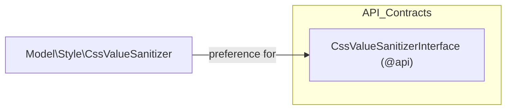

# Muon_Core — Technical Reference

[Back to README](../README.md)

This document is generated from the module's own code and XML files. Every entry cites
its source file path. Sections with no entries are omitted.

## Public API Surface

| Type | Name | Source |
|------|------|--------|
| interface | `Muon\Core\Api\CssValueSanitizerInterface` | `Api/CssValueSanitizerInterface.php:30` |

### `CssValueSanitizerInterface` methods

| Method | Parameters | Returns |
|--------|-----------|---------|
| `color` | `string $value` | `?string` — `null` when the value is not a recognised colour |
| `pixels` | `string $value`, `int $min`, `int $max` | `?string` — `null` when the value is not numeric |
| `fontFamily` | `string $value` | `?string` — `null` when the value could terminate a declaration |
| `fontWeight` | `string $value` | `?string` — `null` when the value is not one of the nine numeric weights |
| `keyword` | `string $value`, `array $allowed`, `string $default` | `string` — always one of `$allowed` |

Source: `Api/CssValueSanitizerInterface.php:38,48,56,64,74`

## Preferences

| Kind | Name | Class | Target | Source |
|------|------|-------|--------|--------|
| preference | `Muon\Core\Api\CssValueSanitizerInterface` | `Muon\Core\Model\Style\CssValueSanitizer` | `Muon\Core\Api\CssValueSanitizerInterface` | `etc/di.xml` |

### Architecture



## Static Assets

| Asset | Detail | Source |
|-------|--------|--------|
| `accessible-menu-top-link-disclosure.iife.js` | `accessible-menu` 4.4.0, `TopLinkDisclosureMenu` + `Treeview` IIFE bundle, ISC licence, 33,330 bytes | `view/frontend/web/js/vendor/` |

Provenance, upstream URL, and the SHA-256 checksum are recorded in
`view/frontend/web/js/vendor/PROVENANCE.md`; the licence text is in
`view/frontend/web/js/vendor/accessible-menu-LICENSE.txt`.

## Module Dependencies

| Package | Constraint |
|---------|-----------|
| `php` | `~8.3.0 \|\| ~8.4.0 \|\| ~8.5.0` |
| `magento/framework` | `^103.0.9` |

Source: `composer.json`

`etc/module.xml` declares no `<sequence>`: the module is a leaf and depends on no other Muon package.

## Source File

This document is auto-generated from the module's source by `magento2-docs-generate@1.3.1`.
Re-run the skill after changing any of the files cited above.

---

## Per-store-view captions (1.4.0)

Shared machinery for entities whose rendered caption varies by store view. Consumed by
`Muon_HeaderMenu` (menu item labels) and `Muon_FooterMenu` (column headings and link labels).

### `@api` contracts

| Interface | Methods | Source |
|---|---|---|
| `Muon\Core\Api\Data\ScopedCaptionInterface` | `getStoreId(): int`, `setStoreId(int): static`, `getCaption(): string`, `setCaption(string): static` | `Api/Data/ScopedCaptionInterface.php` |
| `Muon\Core\Api\CaptionStorageInterface` | `loadForEntities(array): array`, `loadForStore(array, int): array`, `save(int, ?array): void`, `deleteForEntity(int): void` | `Api/CaptionStorageInterface.php` |
| `Muon\Core\Api\CaptionResolverInterface` | `resolve(array, int, string): string` | `Api/CaptionResolverInterface.php` |

### Implementations

| Class | Role | Source |
|---|---|---|
| `Model\Caption\ScopedCaption` | DTO (`AbstractSimpleObject`) | `Model/Caption/ScopedCaption.php` |
| `Model\Caption\CaptionStorage` | Persistence, configured per entity by DI | `Model/Caption/CaptionStorage.php` |
| `Model\Caption\CaptionResolver` | Override-or-default choice | `Model/Caption/CaptionResolver.php` |
| `Model\Caption\CaptionValidator` | Store existence, uniqueness, 255-char limit | `Model/Caption/CaptionValidator.php` |
| `Model\Caption\CaptionListConverter` | DTO list ⇄ store-id map, preserving `null` | `Model/Caption/CaptionListConverter.php` |
| `Model\Caption\CaptionScope` | Current admin store scope | `Model/Caption/CaptionScope.php` |
| `Model\Caption\UseDefaultReader` | Reads the posted `use_default` flags | `Model/Caption/UseDefaultReader.php` |
| `Ui\DataProvider\Modifier\StoreScopeFields` | Adds the "Use Default Value" checkbox and locks structural fields | `Ui/DataProvider/Modifier/StoreScopeFields.php` |
| `view/adminhtml/web/js/grid/store-scoped-provider.js` | Grid data provider that carries `store` into the listing's AJAX request | same |

### DI preferences

Declared in `etc/di.xml`: `ScopedCaptionInterface` → `ScopedCaption`, `CaptionResolverInterface` →
`CaptionResolver`.

**`CaptionStorageInterface` has no preference, deliberately.** It is bound per entity through a
virtual type carrying that entity's table and column names. A default binding would construct an
instance with empty identifiers that fails at query time with an opaque SQL error; unbound, a missing
virtual type is an immediate, named DI error.

```xml
<virtualType name="Muon\HeaderMenu\Model\Caption\ItemCaptionStorage"
             type="Muon\Core\Model\Caption\CaptionStorage">
    <arguments>
        <argument name="table" xsi:type="string">muon_headermenu_item_caption</argument>
        <argument name="entityColumn" xsi:type="string">item_id</argument>
        <argument name="captionColumn" xsi:type="string">label</argument>
    </arguments>
</virtualType>
```

### Two rules that are easy to invert

**`save(int, ?array)` — `null` and `[]` differ.** `null` means "the caller did not mention captions"
and leaves every row untouched; `[]` means "the caller supplied an empty set" and removes them all.
Inverting these wipes every translation on a partial REST update.

**Fallback is verbatim.** `CaptionResolver` returns the entity's own caption unchanged when a store
has no override. The default is never routed through `__()`, so a caption whose wording collides with
a translation key ("Sale", "Home", "Back") cannot be silently rewritten.
