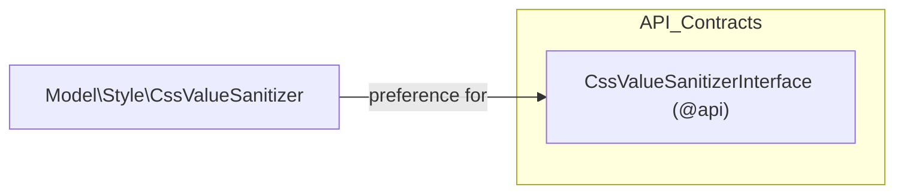

# Muon_Core — Technical Reference

[Back to README](../README.md)

This document is generated from the module's own code and XML files. Every entry cites
its source file path. Sections with no entries are omitted.

## Public API Surface

| Type | Name | Source |
|------|------|--------|
| interface | `Muon\Core\Api\CssValueSanitizerInterface` | `Api/CssValueSanitizerInterface.php:30` |

### `CssValueSanitizerInterface` methods

| Method | Parameters | Returns |
|--------|-----------|---------|
| `color` | `string $value` | `?string` — `null` when the value is not a recognised colour |
| `pixels` | `string $value`, `int $min`, `int $max` | `?string` — `null` when the value is not numeric |
| `fontFamily` | `string $value` | `?string` — `null` when the value could terminate a declaration |
| `fontWeight` | `string $value` | `?string` — `null` when the value is not one of the nine numeric weights |
| `keyword` | `string $value`, `array $allowed`, `string $default` | `string` — always one of `$allowed` |

Source: `Api/CssValueSanitizerInterface.php:38,48,56,64,74`

## Preferences

| Kind | Name | Class | Target | Source |
|------|------|-------|--------|--------|
| preference | `Muon\Core\Api\CssValueSanitizerInterface` | `Muon\Core\Model\Style\CssValueSanitizer` | `Muon\Core\Api\CssValueSanitizerInterface` | `etc/di.xml` |

### Architecture

## Static Assets

| Asset | Detail | Source |
|-------|--------|--------|
| `accessible-menu-top-link-disclosure.iife.js` | `accessible-menu` 4.4.0, `TopLinkDisclosureMenu` + `Treeview` IIFE bundle, ISC licence, 33,330 bytes | `view/frontend/web/js/vendor/` |

Provenance, upstream URL, and the SHA-256 checksum are recorded in
`view/frontend/web/js/vendor/PROVENANCE.md`; the licence text is in
`view/frontend/web/js/vendor/accessible-menu-LICENSE.txt`.

## Module Dependencies

| Package | Constraint |
|---------|-----------|
| `php` | `~8.3.0 \|\| ~8.4.0 \|\| ~8.5.0` |
| `magento/framework` | `^103.0.9` |

Source: `composer.json`

`etc/module.xml` declares no `<sequence>`: the module is a leaf and depends on no other Muon package.

## Source File

This document is auto-generated from the module's source by `magento2-docs-generate@1.3.1`.
Re-run the skill after changing any of the files cited above.
